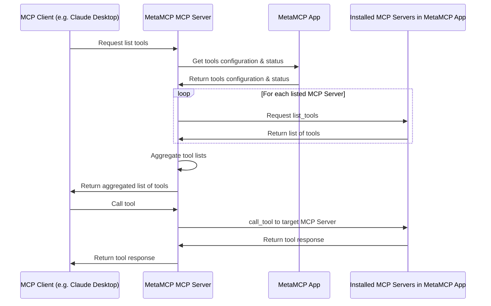

# MetaMCP App

MetaMCP App is a GUI app to manage MCP tools using [MCP (Model Context Protocol)](https://modelcontextprotocol.io/). It has to be used with [mcp-server-metatool](https://github.com/metatool-ai/mcp-server-metatool) together. `mcp-server-metatool` is a proxy MCP server that joins MCP servers configured in this MetaMCP App GUI. It supports routing `list_tools` and `call_tool` in MCP.

The app is prioritized to be self hostable at first, and it is completely free and open source.

https://github.com/user-attachments/assets/1ab4515b-18dd-4863-aa11-72674910d330



## Highlights

- You only need to install one mcp-server-metatool MCP server and metatool will handle the rest for you.
- GUI MetaMCP App, easy to use, add/remove/toggle on-offs mcp servers easily.
- Free, open source, self hostable.
- Project allows you to use MetaMCP in multiple MCP clients.
- Profile allows you to switch tool combinations on a single MCP client without pain.

## Installation
To get started with MetaMCP App, the eastiest way is to clone the repository and use Docker Compose to run it.

```bash
git clone https://github.com/metatool-ai/metatool-app.git
cd metatool-app
cp example.env .env
docker compose up --build -d
```

Then open http://localhost:12005 in your browser to open MetaMCP App.

It is recommended to have npx (node.js based mcp) and uvx (python based mcp) installed globally.
To install uv check: https://docs.astral.sh/uv/getting-started/installation/

You also need a MCP Client to connect to `mcp-server-metatool`. For example if you are using [Claude Desktop](https://modelcontextprotocol.io/quickstart/user), the config json may look like this:
```json
{
  "mcpServers": {
    "metatool": {
      "command": "uvx",
      "args": ["mcp-server-metatool"],
      "env": {
        "METATOOL_API_KEY": "<your api key>"
      }
    }
  }
}
```

Optionally you can also set the url to MetaMCP App server:
```json
{
  "mcpServers": {
    "metatool": {
      "command": "uvx",
      "args": ["mcp-server-metatool"],
      "env": {
        "METATOOL_API_KEY": "<your api key>",
        "METATOOL_API_BASE_URL": "http://localhost:12005"
      }
    }
  }
}
```

You can get the API key from the MetaMCP App's API Keys page.

## Concepts

- MCP Server MetaMCP: you only need to configure once to connect to mcp-server-metatool, then you can manage tools in MetaMCP App forever. `mcp-server-metatool` is a proxy MCP server that itself is a MCP Client that connects to and joins MCP servers tools configured in this MetaMCP App GUI. For details check out [mcp-server-metatool](https://github.com/metatool-ai/mcp-server-metatool) repo.
- GUI MetaMCP App: use GUI to manage MCP servers integrations: the servers and tools can be dynamically added or removed on the go through GUI.
- Projects and API Keys: at project level you can create API Keys for connection and auth. Project level enables usages across MCP Clients. E.g. you can have default project to use with Claude Desktop and another project to use with another MCP Client.
- Profiles layer under projects: each project can have multiple profiles, each profile can have different tools and configurations. And you can activate a profile for a project and have exactly one profile active at a time. You can easily switch between profiles using the GUI and don't need to worry about reconfiguring your MCP Client connections to MCP servers.
- Tools Management: under profile level you can also toggle on-offs of mcp servers you added.
- Tool level of MCP servers toggle on-offs are TBA.

## License
Elastic License 2.0 (ELv2)

## Credits

- Demo video uses MCP Client [5ire](https://5ire.app/)
