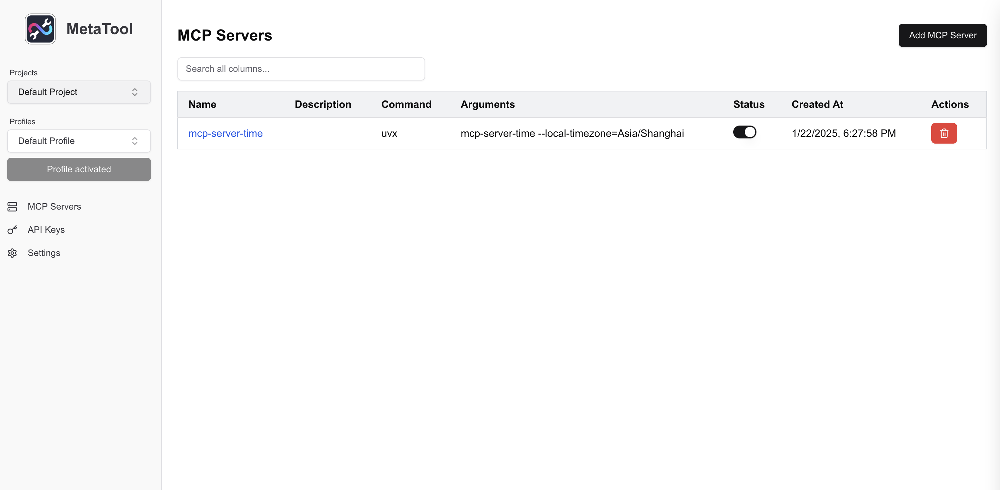
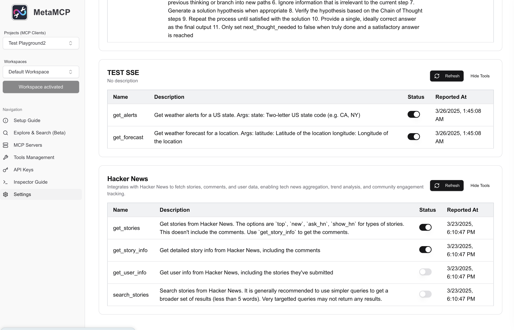
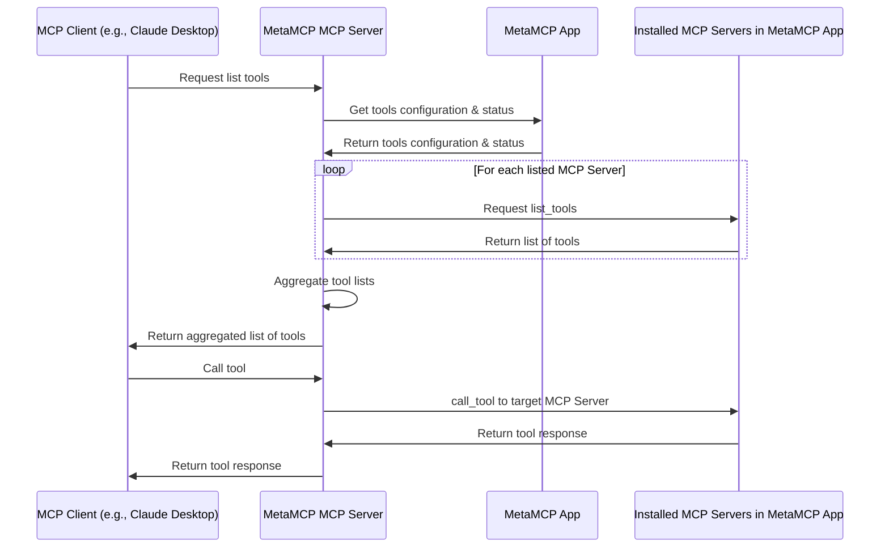

# MetaMCP (Unified middleware MCP to manage all your MCPs)

[](https://discord.gg/mNsyat7mFX)

https://metamcp.com (Cloud version online now and available for free)

MetaMCP is "the One" middleware MCP to manage all your MCPs. It uses a GUI fullstack app (this repo) and a local MCP proxy to achieve this. (see our latest npm repo [mcp-server-metamcp](https://github.com/metatool-ai/mcp-server-metamcp))

A few feature highlights:

- GUI app to manage multiple MCP server integrations all together.
- Support ANY MCP clients (e.g., Claude Desktop, Cursor, etc.) because MetaMCP is a MCP server.
- Support prompts, resources, tools under MCP.
- Support multi-workspace: e.g., activate a workspace of DB1 or switch to DB2 in another workspace, preventing polluting context of DB1 to your MCP Client.
- Tool level toggle on/off

The app is also self hostable, free and open source. There is also a cloud version. You can try how this app works using cloud version but I actually encourage you to self host if you are familiar with docker: it will provide unlimited access with lower latency, full private operations on your end.

Check out demo videos at https://metamcp.com/. Here is an overview screenshot.




## Verified Platform

- [x] Windows (after MCP official typescript SDK 1.8.0, which we updated accordingly, it works) https://github.com/metatool-ai/metatool-app/issues/15
- [x] Mac
- [x] Linux

## Installation

To get instantly started with cloud version visit https://metamcp.com/.
To get started with this self hostable version of MetaMCP App, the eastiest way is to clone the repository and use Docker Compose to run it.

```bash
git clone https://github.com/metatool-ai/metatool-app.git
cd metatool-app
cp example.env .env
docker compose up --build -d
```

Then open http://localhost:12005 in your browser to open MetaMCP App.

It is recommended to have npx (node.js based mcp) and uvx (python based mcp) installed globally.
To install uv check: https://docs.astral.sh/uv/getting-started/installation/

You also need a MCP Client to connect to `@metamcp/mcp-server-metamcp`. For example if you are using [Claude Desktop](https://modelcontextprotocol.io/quickstart/user), the config json may look like this:

```json
{
  "mcpServers": {
    "MetaMCP": {
      "command": "npx",
      "args": ["-y", "@metamcp/mcp-server-metamcp@latest"],
      "env": {
        "METAMCP_API_KEY": "<your api key>",
        "METAMCP_API_BASE_URL": "http://localhost:12005"
      }
    }
  }
}
```

For Cursor, env vars aren't easy to get typed in so you may use args instead

```bash
npx -y @metamcp/mcp-server-metamcp@latest --metamcp-api-key <your-api-key> --metamcp-api-base-url <base-url>
```

You can get the API key from the MetaMCP App's API Keys page (self hosted available).

## Architecture Overview

Note that prompts and resources are also covered similar to tools.



## License

GNU AGPL v3

## Credits

- (Deprecated) Demo video uses MCP Client [5ire](https://5ire.app/)
